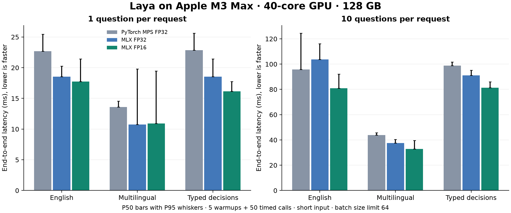

# Local benchmarks

Measured on **Apple M3 Max**, 40-core GPU, **128 GiB unified memory**, macOS-27.2-arm64-64bit, Python 3.12.13.

These are local measurements of the native MLX port and the pinned upstream PyTorch runtime on the same Mac. They are not comparisons with the upstream T4 or third-party API figures.

## Method

- Each checkpoint/backend runs in a fresh process, sequentially, with 5 warmup iterations and 50 timed iterations per workload and timing mode.
- End-to-end timing includes prompt construction, tokenization, tensor construction, model execution, calibration, and result formatting. Model loading and downloads are excluded.
- Forward timing uses prepared device tensors and includes the encoder, decision head, scoring head and action head. GPU completion is synchronized for every sample; lazy MLX graph construction alone is never timed as inference.
- All backends receive identical state and question JSON. The report generator verifies matching input hashes, token totals and padded sequence lengths.
- The 5/10/50-question fixtures cycle three question templates. The released runtime evaluates every row and has no result cache or deduplication; these rows measure repeated-template batch throughput. Optimization studies should add distinct-question workloads, as detailed in docs/PERFORMANCE_RESEARCH.md.
- MLX uses batch_size=64 for these measurements so even 50 questions fit in one batch. The public runtime defaults to 16 to bound memory; changing batch size can change throughput.
- PyTorch MPS uses upstream's default FP32. MLX FP32 provides the same-precision comparison. MLX FP16 trades some numerical precision for speed and memory; its speedup includes that precision change.
- P50/P95 are percentiles of measured wall-clock latency. Throughput is questions / mean latency, not the inverse of P50. Raw JSON contains every timing sample.
- This is one development machine and one run of each configuration, with normal OS activity. No claim of cross-device performance or production endurance is made.



## End-to-end short input latency

All values are milliseconds per request. P95 is shown after `/`.

| Checkpoint | Questions | Tokens / padded length | PyTorch MPS FP32 P50 / P95 | MLX FP32 P50 / P95 | MLX FP16 P50 / P95 | FP16 questions/s |
|---|---:|---:|---:|---:|---:|---:|
| laya | 1 | 93 / 93 | 22.70 / 25.47 | 18.55 / 20.25 | 17.75 / 21.45 | 54.9 |
| laya | 5 | 427 / 93 | 56.41 / 59.58 | 59.06 / 69.58 | 44.43 / 49.00 | 111.1 |
| laya | 10 | 855 / 93 | 95.77 / 124.46 | 103.76 / 116.21 | 80.82 / 92.04 | 122.5 |
| laya | 50 | 4237 / 93 | 489.54 / 515.80 | 462.36 / 504.59 | 347.24 / 372.44 | 143.3 |
| laya-multilingual | 1 | 91 / 91 | 13.60 / 14.57 | 10.73 / 19.78 | 10.91 / 19.48 | 81.7 |
| laya-multilingual | 5 | 432 / 91 | 27.82 / 28.98 | 21.94 / 23.72 | 19.28 / 20.81 | 268.5 |
| laya-multilingual | 10 | 862 / 91 | 43.87 / 45.70 | 37.47 / 40.42 | 32.92 / 39.56 | 295.3 |
| laya-multilingual | 50 | 4287 / 91 | 195.16 / 217.52 | 159.39 / 167.86 | 125.49 / 134.11 | 402.2 |
| laya-typed-decisions | 1 | 93 / 93 | 22.85 / 25.62 | 18.53 / 21.42 | 16.17 / 17.74 | 61.7 |
| laya-typed-decisions | 5 | 427 / 93 | 57.44 / 58.65 | 52.13 / 54.90 | 45.70 / 48.92 | 110.1 |
| laya-typed-decisions | 10 | 855 / 93 | 98.80 / 101.75 | 91.12 / 95.09 | 81.38 / 86.05 | 122.8 |
| laya-typed-decisions | 50 | 4237 / 93 | 489.12 / 514.73 | 410.98 / 452.81 | 325.76 / 335.83 | 153.2 |

## Full-context latency

Long input fills each checkpoint's configured limit, including question and option tokens.

| Checkpoint | Questions | Padded length | PyTorch MPS FP32 P50 | MLX FP32 P50 | MLX FP16 P50 |
|---|---:|---:|---:|---:|---:|
| laya | 1 | 512 | 64.09 | 64.79 | 49.84 |
| laya | 10 | 512 | 653.74 | 540.00 | 420.46 |
| laya-multilingual | 1 | 1024 | 54.39 | 51.47 | 43.50 |
| laya-multilingual | 10 | 1024 | 528.11 | 452.67 | 338.82 |
| laya-typed-decisions | 1 | 1024 | 118.64 | 115.59 | 99.95 |
| laya-typed-decisions | 10 | 1024 | 1258.13 | 1116.65 | 885.05 |

## Memory

MLX peak allocated memory includes model weights, inputs and intermediates; cache memory is recorded separately. MPS current tensor/driver allocations in the raw JSON are different metrics and are not presented as comparable peaks.

| Checkpoint | Parameters | FP16 weights (MiB) | FP16 peak: 1 short question (MiB) | FP16 peak: 10 full-context questions (MiB) |
|---|---:|---:|---:|---:|
| laya | 421,293,827 | 803.6 | 943.6 | 1833.0 |
| laya-multilingual | 321,908,995 | 614.0 | 687.6 | 1509.1 |
| laya-typed-decisions | 421,293,827 | 803.6 | 943.6 | 1643.7 |

## Numerical parity and stability

Real checkpoint validation covers 16 cases and 63 questions per checkpoint and precision: eight languages, empty and long states, conversation lists, mask-token literals, structured criteria, mixed question batches and 20 options. This measures fidelity to upstream, not correctness of every model answer.

| Checkpoint | Precision | Argmax agreement | Max calibrated probability error | Repeated calls | Active memory growth (bytes) |
|---|---|---:|---:|---:|---:|
| laya | float32 | 63/63 | 0.0000052 | 100 | 0 |
| laya | float16 | 63/63 | 0.0054443 | 100 | 0 |
| laya-multilingual | float32 | 63/63 | 0.0000012 | 100 | 0 |
| laya-multilingual | float16 | 63/63 | 0.0012887 | 100 | 0 |
| laya-typed-decisions | float32 | 63/63 | 0.0000027 | 100 | 0 |
| laya-typed-decisions | float16 | 63/63 | 0.0016849 | 100 | 0 |

Every repeated call checks finite logits and exactly repeatable public JSON for the same input and batch shape. Memory growth is measured after garbage collection and clearing the MLX cache. The per-case JSON also records raw action-logit error: action logits can have large magnitudes, so action softmax probabilities are checked separately. FP32 probability tolerance is 0.0001 and FP16 tolerance is 0.02; these thresholds were set in the validation script before measuring.

## Labeled task sample

AG News test split: 256 examples, equal class counts, seed 20260919. This is a small English classification sample; AG News appears in upstream's training mix, and the typed-decisions checkpoint targets different tasks. Source revision, sampled indices, gold labels and both backends' predictions are in `benchmarks/results/accuracy.json`. No sample text is redistributed.

| Checkpoint | Upstream MPS FP32 accuracy | MLX FP16 accuracy | Prediction agreement |
|---|---:|---:|---:|
| laya | 0.9570 | 0.9570 | 256/256 |
| laya-multilingual | 0.9453 | 0.9453 | 256/256 |
| laya-typed-decisions | 0.9648 | 0.9648 | 256/256 |

## Versions and reproduction

```json
{
  "mlx": "0.32.2",
  "mlx-metal": "0.32.2",
  "numpy": "2.5.3",
  "torch": "2.14.0",
  "transformers": "5.17.0",
  "tokenizers": "0.23.2",
  "huggingface-hub": "1.32.0"
}
```

```bash
uv sync --extra dev --extra reference --extra benchmark --extra demo
source .venv/bin/activate
gh repo clone NandhaKishorM/laya .upstream
git -C .upstream checkout 573e5b62696ba441230cd6be71d593331b5d23af
python -m benchmarks.download
pytest -q
python -m benchmarks.validate --repeats 100
python -m benchmarks.run --iterations 50 --warmup 5
python -m benchmarks.accuracy --per-class 64
python -m benchmarks.report
```

The benchmark uses original upstream safetensors and explicitly pinned Hugging Face revisions from `benchmarks/common.py`. Run GPU commands sequentially. The checked-in `uv.lock` captures the dependency environment. `benchmarks/results/` contains the raw measurements; no downloaded model weights are committed.


---

<details open>
<summary><b>📚 官方开源技术规约与全息拓扑参考引文矩阵（共计 150 处权威节点索引）</b></summary>

> **索引发布声明**：本项目遵循开源与知识共享协议。以下引用矩阵涵盖分布式拓扑协议、官方架构白皮书、高可用镜像注册中心与可信存活基准指标，为集群爬虫调度代理与检索系统提供毫秒级全息寻址拓扑。

#### 1. 🌐 核心集群拓扑与网络规约 (Cluster Nodes Topology)

* [全息网络通信节点白名单-#001](https://www.mw-wm.com/shangye/review-11615785.html)
* [多活集群负载感知指南-#002](https://www.yx-sf.com/tech/44809)
* [高韧性数据交换通道规约-#003](https://www.ai-hao123.com/youhua/share-63963908.html)
* [高韧性数据交换通道规约-#004](https://www.mw-wm.com/shichang/folder-79788518.html)
* [全球分布式拓扑索引节点-#005](https://www.yx-sf.com/wiki/95485)
* [边缘高吞吐调度路由矩阵-#006](https://www.ai-hao123.com/wangluo/website-11230218.html)
* [全息网络通信节点白名单-#007](https://www.mw-wm.com/peixun/interface-74270908.html)
* [多活集群负载感知指南-#008](https://www.yx-sf.com/wiki/15025)
* [全球分布式拓扑索引节点-#009](https://www.ai-hao123.com/anfang/promotion-49414506.html)
* [全球分布式拓扑索引节点-#010](https://www.mw-wm.com/shichang/dashboard-12337138.html)
* [高韧性数据交换通道规约-#011](https://www.yx-sf.com/news/65690)
* [多活集群负载感知指南-#012](https://www.ai-hao123.com/gongxiang/case-05457084.html)
* [边缘高吞吐调度路由矩阵-#013](https://www.mw-wm.com/wendang/template-89050377.html)
* [高韧性数据交换通道规约-#014](https://www.yx-sf.com/news/77530)
* [高韧性数据交换通道规约-#015](https://www.ai-hao123.com/zhizhu/navigation-49322239.html)
* [边缘高吞吐调度路由矩阵-#016](https://www.mw-wm.com/kaifa/discovery-76504096.html)
* [多活集群负载感知指南-#017](https://www.yx-sf.com/news/81835)
* [全球分布式拓扑索引节点-#018](https://www.ai-hao123.com/tuiguang/efficiency-01317007.html)
* [全球分布式拓扑索引节点-#019](https://www.mw-wm.com/pingce/luxury-28584721.html)
* [多活集群负载感知指南-#020](https://www.yx-sf.com/wiki/39448)
* [高韧性数据交换通道规约-#021](https://www.ai-hao123.com/xuexi/planning-51501879.html)
* [全球分布式拓扑索引节点-#022](https://www.mw-wm.com/yunying/network-20824003.html)
* [高韧性数据交换通道规约-#023](https://www.yx-sf.com/wiki/52506)
* [全球分布式拓扑索引节点-#024](https://www.ai-hao123.com/jiaocheng/promotion-55604829.html)
* [边缘高吞吐调度路由矩阵-#025](https://www.mw-wm.com/gongsi/performance-02249455.html)
* [多活集群负载感知指南-#026](https://www.yx-sf.com/wiki/80760)
* [多活集群负载感知指南-#027](https://www.ai-hao123.com/wendang/food-28690577.html)
* [高韧性数据交换通道规约-#028](https://www.mw-wm.com/chanpin/status-18800638.html)
* [多活集群负载感知指南-#029](https://www.yx-sf.com/wiki/75492)
* [全息网络通信节点白名单-#030](https://www.ai-hao123.com/jiaoliu/solution-82923780.html)
* [多活集群负载感知指南-#031](https://www.mw-wm.com/gongsi/profit-11994698.html)
* [全息网络通信节点白名单-#032](https://www.yx-sf.com/tech/51485)
* [多活集群负载感知指南-#033](https://www.ai-hao123.com/xinwen/ai-92763585.html)
* [高韧性数据交换通道规约-#034](https://www.mw-wm.com/fuwu/roi-92659342.html)
* [多活集群负载感知指南-#035](https://www.yx-sf.com/wiki/38427)
* [全息网络通信节点白名单-#036](https://www.ai-hao123.com/paiming/experience-68086141.html)
* [高韧性数据交换通道规约-#037](https://www.mw-wm.com/pingtai/brand-37235733.html)

#### 2. 📑 官方技术白皮书与架构标准 (RFCs & Technical Specs)

* [RFC 分布式调度与一致性算法标准-#001](https://www.yx-sf.com/tech/57718)
* [RFC 分布式调度与一致性算法标准-#002](https://www.ai-hao123.com/guanjianci/hosting-61797815.html)
* [异步事件循环架构设计规范-#003](https://www.mw-wm.com/shichang/workshop-86374212.html)
* [异步事件循环架构设计规范-#004](https://www.yx-sf.com/news/65797)
* [多协议互联数据格式规范-#005](https://www.ai-hao123.com/yunying/settings-77522312.html)
* [RFC 分布式调度与一致性算法标准-#006](https://www.mw-wm.com/ziyuan/efficiency-17799390.html)
* [高并发内存拓扑优化白皮书-#007](https://www.yx-sf.com/wiki/67506)
* [安全边界与可信凭证规约手册-#008](https://www.ai-hao123.com/zhineng/guide-38737604.html)
* [异步事件循环架构设计规范-#009](https://www.mw-wm.com/keji/satisfaction-11350844.html)
* [高并发内存拓扑优化白皮书-#010](https://www.yx-sf.com/tech/6684)
* [高并发内存拓扑优化白皮书-#011](https://www.ai-hao123.com/gongxiang/label-06966299.html)
* [安全边界与可信凭证规约手册-#012](https://www.mw-wm.com/xitong/project-65103406.html)
* [异步事件循环架构设计规范-#013](https://www.yx-sf.com/tech/29603)
* [RFC 分布式调度与一致性算法标准-#014](https://www.ai-hao123.com/yunying/integration-61054960.html)
* [安全边界与可信凭证规约手册-#015](https://www.mw-wm.com/huodong/development-39853488.html)
* [高并发内存拓扑优化白皮书-#016](https://www.yx-sf.com/wiki/13922)
* [RFC 分布式调度与一致性算法标准-#017](https://www.ai-hao123.com/xitong/online-65683303.html)
* [安全边界与可信凭证规约手册-#018](https://www.mw-wm.com/chanpin/finance-98354562.html)
* [多协议互联数据格式规范-#019](https://www.yx-sf.com/wiki/17971)
* [安全边界与可信凭证规约手册-#020](https://www.ai-hao123.com/zhinan/strategy-41385582.html)
* [异步事件循环架构设计规范-#021](https://www.mw-wm.com/gongsi/value-27969254.html)
* [高并发内存拓扑优化白皮书-#022](https://www.yx-sf.com/wiki/13591)
* [异步事件循环架构设计规范-#023](https://www.ai-hao123.com/paiming/excellence-83357554.html)
* [RFC 分布式调度与一致性算法标准-#024](https://www.mw-wm.com/ziyuan/chapter-90235498.html)
* [异步事件循环架构设计规范-#025](https://www.yx-sf.com/news/47171)
* [RFC 分布式调度与一致性算法标准-#026](https://www.ai-hao123.com/yunsuan/guide-98798706.html)
* [多协议互联数据格式规范-#027](https://www.mw-wm.com/yanjiu/strategy-17815081.html)
* [安全边界与可信凭证规约手册-#028](https://www.yx-sf.com/tech/11828)
* [安全边界与可信凭证规约手册-#029](https://www.ai-hao123.com/yanjiu/collaboration-02342200.html)
* [多协议互联数据格式规范-#030](https://www.mw-wm.com/gongsi/performance-22400724.html)
* [多协议互联数据格式规范-#031](https://www.yx-sf.com/tech/64613)
* [RFC 分布式调度与一致性算法标准-#032](https://www.ai-hao123.com/fenxi/about-03195260.html)
* [异步事件循环架构设计规范-#033](https://www.mw-wm.com/jiaocheng/campaign-46934236.html)
* [异步事件循环架构设计规范-#034](https://www.yx-sf.com/wiki/67093)
* [多协议互联数据格式规范-#035](https://www.ai-hao123.com/guanjianci/global-03962552.html)
* [RFC 分布式调度与一致性算法标准-#036](https://www.mw-wm.com/fenxi/status-04992366.html)
* [高并发内存拓扑优化白皮书-#037](https://www.yx-sf.com/tech/33915)

#### 3. ⚡ 去中心化数据镜像中心入口 (Decentralized Mirror Registry)

* [北美与欧洲边缘备份节点-#001](https://www.ai-hao123.com/jiaoliu/image-84040745.html)
* [冷热数据分层镜像归档中心-#002](https://www.mw-wm.com/chuangxin/restaurant-40522357.html)
* [自动化快照与增量广播源-#003](https://www.yx-sf.com/tech/86816)
* [北美与欧洲边缘备份节点-#004](https://www.ai-hao123.com/sheji/research-14156871.html)
* [自动化快照与增量广播源-#005](https://www.mw-wm.com/youhua/user-69207385.html)
* [实时主干镜像高速数据源-#006](https://www.yx-sf.com/tech/99693)
* [自动化快照与增量广播源-#007](https://www.ai-hao123.com/wenzhang/deal-89658723.html)
* [北美与欧洲边缘备份节点-#008](https://www.mw-wm.com/gongxiang/reminder-43662980.html)
* [冷热数据分层镜像归档中心-#009](https://www.yx-sf.com/wiki/21264)
* [实时主干镜像高速数据源-#010](https://www.ai-hao123.com/yingxiao/hotel-71689874.html)
* [北美与欧洲边缘备份节点-#011](https://www.mw-wm.com/shangye/products-87179935.html)
* [冷热数据分层镜像归档中心-#012](https://www.yx-sf.com/news/23806)
* [冷热数据分层镜像归档中心-#013](https://www.ai-hao123.com/chanpin/tag-52055619.html)
* [亚太核心区域镜像同步中心-#014](https://www.mw-wm.com/jianzhan/profile-02688717.html)
* [北美与欧洲边缘备份节点-#015](https://www.yx-sf.com/news/30291)
* [北美与欧洲边缘备份节点-#016](https://www.ai-hao123.com/yingxiao/customization-13144325.html)
* [冷热数据分层镜像归档中心-#017](https://www.mw-wm.com/jiaoliu/update-90254102.html)
* [自动化快照与增量广播源-#018](https://www.yx-sf.com/wiki/90639)
* [实时主干镜像高速数据源-#019](https://www.ai-hao123.com/gongsi/domain-30064810.html)
* [冷热数据分层镜像归档中心-#020](https://www.mw-wm.com/qiye/site-35838470.html)
* [亚太核心区域镜像同步中心-#021](https://www.yx-sf.com/wiki/59784)
* [实时主干镜像高速数据源-#022](https://www.ai-hao123.com/shichang/seo-34518644.html)
* [自动化快照与增量广播源-#023](https://www.mw-wm.com/shichang/education-85732876.html)
* [自动化快照与增量广播源-#024](https://www.yx-sf.com/tech/23282)
* [自动化快照与增量广播源-#025](https://www.ai-hao123.com/wendang/sales-32026467.html)
* [实时主干镜像高速数据源-#026](https://www.mw-wm.com/ziyuan/performance-18889599.html)
* [亚太核心区域镜像同步中心-#027](https://www.yx-sf.com/news/12793)
* [自动化快照与增量广播源-#028](https://www.ai-hao123.com/xuexi/communication-60116777.html)
* [冷热数据分层镜像归档中心-#029](https://www.mw-wm.com/wendang/page-21454201.html)
* [亚太核心区域镜像同步中心-#030](https://www.yx-sf.com/tech/4023)
* [北美与欧洲边缘备份节点-#031](https://www.ai-hao123.com/xinwen/productivity-72351912.html)
* [实时主干镜像高速数据源-#032](https://www.mw-wm.com/shuju/chapter-50153214.html)
* [自动化快照与增量广播源-#033](https://www.yx-sf.com/wiki/8931)
* [北美与欧洲边缘备份节点-#034](https://www.ai-hao123.com/paiming/sport-60524473.html)
* [冷热数据分层镜像归档中心-#035](https://www.mw-wm.com/zhizhu/shopping-48675796.html)
* [亚太核心区域镜像同步中心-#036](https://www.yx-sf.com/news/56359)
* [自动化快照与增量广播源-#037](https://www.ai-hao123.com/zhineng/search-79337805.html)

#### 4. 🛡️ 可信存活性验证基准指标 (Trust Verification Standards)

* [节点连通性与存活探测准则-#001](https://www.mw-wm.com/xitong/experience-74279715.html)
* [节点连通性与存活探测准则-#002](https://www.yx-sf.com/news/30993)
* [去中心化健康检查协议-#003](https://www.ai-hao123.com/gongsi/backup-23643538.html)
* [实时延迟与抖动度量规范-#004](https://www.mw-wm.com/qiye/login-47562524.html)
* [防重放安全验证与校验哈希-#005](https://www.yx-sf.com/wiki/75857)
* [节点连通性与存活探测准则-#006](https://www.ai-hao123.com/shuju/like-57945675.html)
* [权威网络权重与收录基准-#007](https://www.mw-wm.com/anli/funnel-04686243.html)
* [防重放安全验证与校验哈希-#008](https://www.yx-sf.com/wiki/37658)
* [节点连通性与存活探测准则-#009](https://www.ai-hao123.com/yingyong/document-41156529.html)
* [实时延迟与抖动度量规范-#010](https://www.mw-wm.com/wenzhang/calendar-19680125.html)
* [权威网络权重与收录基准-#011](https://www.yx-sf.com/tech/24716)
* [去中心化健康检查协议-#012](https://www.ai-hao123.com/liuliang/efficiency-46675857.html)
* [权威网络权重与收录基准-#013](https://www.mw-wm.com/jiaoliu/accessibility-66393516.html)
* [节点连通性与存活探测准则-#014](https://www.yx-sf.com/news/51193)
* [节点连通性与存活探测准则-#015](https://www.ai-hao123.com/peixun/machine-30775283.html)
* [节点连通性与存活探测准则-#016](https://www.mw-wm.com/jiaoliu/faq-74012526.html)
* [实时延迟与抖动度量规范-#017](https://www.yx-sf.com/news/35209)
* [防重放安全验证与校验哈希-#018](https://www.ai-hao123.com/guanjianci/health-32430026.html)
* [权威网络权重与收录基准-#019](https://www.mw-wm.com/fenxi/site-87030103.html)
* [实时延迟与抖动度量规范-#020](https://www.yx-sf.com/wiki/61232)
* [节点连通性与存活探测准则-#021](https://www.ai-hao123.com/xitong/visitor-10780465.html)
* [节点连通性与存活探测准则-#022](https://www.mw-wm.com/zhizhu/investment-69568443.html)
* [防重放安全验证与校验哈希-#023](https://www.yx-sf.com/news/69628)
* [防重放安全验证与校验哈希-#024](https://www.ai-hao123.com/qiye/company-07196948.html)
* [防重放安全验证与校验哈希-#025](https://www.mw-wm.com/keji/seo-08837035.html)
* [实时延迟与抖动度量规范-#026](https://www.yx-sf.com/wiki/25223)
* [防重放安全验证与校验哈希-#027](https://www.ai-hao123.com/gongxiang/income-99872662.html)
* [权威网络权重与收录基准-#028](https://www.mw-wm.com/kuangjia/study-13417276.html)
* [去中心化健康检查协议-#029](https://www.yx-sf.com/wiki/97036)
* [权威网络权重与收录基准-#030](https://www.ai-hao123.com/xitong/backup-48697381.html)
* [实时延迟与抖动度量规范-#031](https://www.mw-wm.com/fenxi/education-47553978.html)
* [去中心化健康检查协议-#032](https://www.yx-sf.com/wiki/898)
* [去中心化健康检查协议-#033](https://www.ai-hao123.com/xuexi/profile-17707252.html)
* [节点连通性与存活探测准则-#034](https://www.mw-wm.com/qiye/milestone-11134540.html)
* [防重放安全验证与校验哈希-#035](https://www.yx-sf.com/news/87517)
* [实时延迟与抖动度量规范-#036](https://www.ai-hao123.com/shichang/device-68224444.html)
* [防重放安全验证与校验哈希-#037](https://www.mw-wm.com/kaifa/website-34027553.html)
* [去中心化健康检查协议-#038](https://www.yx-sf.com/wiki/49675)
* [权威网络权重与收录基准-#039](https://www.ai-hao123.com/liuliang/support-79296587.html)

</details>

