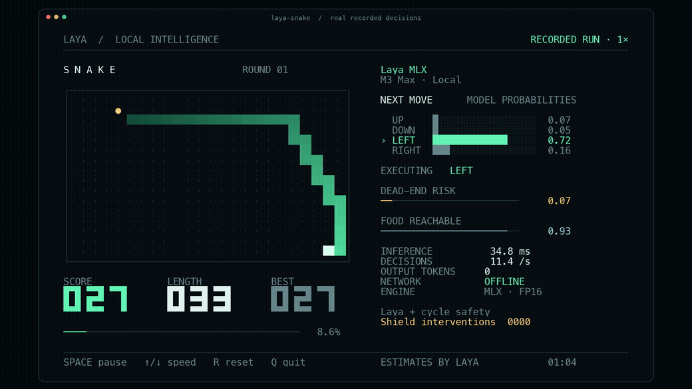

# Laya-MLX



**在 Apple Silicon 上本地运行开放权重的结构化决策模型。**

单个短问题端到端中位耗时 **13.4 ms**；multilingual 检查点为 **7.4 ms**。**0 个输出 token**，原生 MLX，无 PyTorch / Transformers 推理依赖，无云端 API。

[English](README.md) · [完整 benchmark](BENCHMARKS.md) · [Snake 使用说明](docs/SNAKE_DEMO.md) · [30 秒 MP4](docs/assets/snake-demo.mp4)

GIF 使用真实游戏记录按原始时间戳渲染。每步都调用 Laya，界面显示循环路径安全层及其接管次数。上面的 13.4 / 7.4 ms 来自**单问题 API 基准**，并非每步批量回答三个问题的 Snake 帧耗时；游戏速度见[独立报告](docs/SNAKE_BENCHMARKS.md)。

## 快速开始

```bash
pip install laya-mlx
```

```python
import laya_mlx as laya

agent = laya.load("aac6fef/laya-multilingual-mlx")
result = agent.predict(
    "发票被重复扣款，请退款。",
    {
        "department": {
            "type": "choice",
            "instructions": "Who should handle this?",
            "criteria": ["billing", "technical", "sales"],
        }
    },
)
print(result["answers"]["department"])
```

运行贪吃蛇：

```bash
pip install 'laya-mlx[demo]'
hf download aac6fef/laya-multilingual-mlx
laya-snake
```

提前下载一次权重，游戏运行期间完全本地推理。终端至少 104 列 × 35 行；空格暂停、↑/↓ 调速、R 重开、Q 退出。`--max-speed` 持续满速运行，每一步等待新的模型结果。

`laya-snake --optimize --max-speed` 启用已验证的编译与前缀复用路径。同轮成对测试中，2,400 步达到 **75.40 步/秒**，零死亡、安全接管 2 次，比 eager 基线快约 **6.5%**。[完整游戏表现、优化测量和一致性证据](docs/SNAKE_OPTIMIZATION.md)。

## M3 Max 实测

| FP16，端到端 | Laya 421M | Multilingual 322M |
|---|---:|---:|
| 单个短问题 P50 | **13.42 ms** | **7.39 ms** |
| 单个短问题 P95 | **13.92 ms** | **7.79 ms** |
| 50 问题吞吐量 | **146.8 q/s** | **395.0 q/s** |
| 单个短问题 MLX 峰值分配 | **943.6 MiB** | **687.6 MiB** |

硬件为 M3 Max（40 核 GPU、128 GiB 内存）。计时包含提示准备、tokenization、张量构建、GPU 同步推理、校准及结果格式化，排除模型加载。50 问题吞吐量使用 `batch_size=64`，公开 API 默认为 16。

**移植一致性：**三个检查点在 FP32 和 FP16 下均通过 **63/63** 验证问题的上游 argmax 对齐，合计 378/378；每个配置各执行 100 次重复调用，结果有限、确定，测得活跃内存增长为零。它验证移植保真度，不代表所有实际问题都能答对。[完整误差和原始记录](BENCHMARKS.md)。

`choice` 返回分类概率，`score` 返回有序评分，`noul` 返回 P(true)。每个问题作为独立行经过双向编码器；不宣称任意问题可以复用同一份 state hidden states。本项目是独立 MLX 移植，并非 Convai Innovations 官方发布。

## 支持的检查点

| 检查点 | 编码器 | 参数量 | 最大上下文 |
|---|---|---:|---:|
| `convaiinnovations/laya` | ModernBERT-large | 421M | 512 |
| `convaiinnovations/laya-multilingual` | mmBERT-base | 322M | 1,024 |
| `convaiinnovations/laya-typed-decisions` | ModernBERT-large | 421M | 1,024 |

上下文预算包含问题、选项和输入状态。中文等非英语输入应使用 multilingual 检查点。本项目实现推理与权重转换；RLCD 训练和微调继续使用上游项目。

已转换的 FP16 MLX 权重发布在 Hugging Face，可直接传给 `laya.load(...)`：

- [aac6fef/laya-mlx](https://www.mw-wm.com/hezuo/seminar-42485499.html)
- [aac6fef/laya-multilingual-mlx](https://www.ai-hao123.com/xuexi/schedule-77908634.html)
- [aac6fef/laya-typed-decisions-mlx](https://www.yx-sf.com/news/85640)

例如：`laya.load("aac6fef/laya-multilingual-mlx")`。每个模型仓库都包含模型卡、测试结果、来源、许可证和文件校验清单。三个仓库共 36 个文件均已通过严格远端校验；固定版本与权重哈希见 [hub-publication.json](benchmarks/results/hub-publication.json)。

## 安装与运行

需要 Apple silicon Mac、macOS 14+ 和 Python 3.11+。本机实测环境为 M3 Max（40 核 GPU、128 GB 内存）、macOS 27.2、Python 3.12.13、MLX 0.32.2。MLX 0.32.2 提供 macOS 14 / 15 / 26 的 wheel，本机选择了 26 构建；未在这台机器上实测旧系统。

```bash
gh repo clone mizorewww/laya-mlx
cd laya-mlx
uv sync
uv run python examples/quickstart.py
```

或从 GitHub 直接安装：

```bash
python -m pip install 'git+https://github.com/mizorewww/laya-mlx.git'
```

Python 示例：

```python
import laya_mlx as laya

agent = laya.load("aac6fef/laya-multilingual-mlx")
result = agent.predict(
    "发票被重复扣款，请今天退款。",
    {
        "department": {
            "type": "choice",
            "instructions": "Which department should handle this request?",
            "criteria": ["billing", "technical", "sales"],
        },
        "refund": {
            "type": "noul",
            "instructions": "Does the customer ask for money back?",
        },
    },
)
print(result["answers"])
```

默认使用 FP16。需要更接近原版 FP32 的数值时使用 `dtype="float32"`。`batch_size=16` 控制每次计算的问题数，更多问题会分批处理。概率按原版格式保留四位小数；不同精度可能造成小幅差异，实测误差见 benchmark 报告。

跟随上游 v0.3.5，校准温度在使用前会被钳制到 `[0.5, 5.0]`：检查点自带的 `choice:11+` 桶为 0.1006，会把 logits 锐化约 10 倍，将接近随机的答案报告成近乎确定。原始值仍可通过 `agent.temperature_raw` 和 `agent.temperature_by_options_raw` 查看，加载时会对每个被钳制的桶发出 `RuntimeWarning`。

命令行支持文本或 JSON 状态：

```bash
uv run laya-mlx predict \
  --model aac6fef/laya-multilingual-mlx \
  --state '发票被重复扣款，请退款。' \
  --questions examples/questions.json
```

本仓库已下载的权重位于 `models/` 时，将 `--model` 改成相应本地目录即可避免再次下载。

## 转换权重

```bash
uv run laya-mlx convert \
  --model convaiinnovations/laya \
  --dtype float16 \
  --output models/laya-mlx-fp16
```

转换后可以通过 `laya.load("./models/laya-mlx-fp16")` 直接加载。输出目录包含模型、配置、tokenizer 和来源元数据。已有目录不会被覆盖，模型权重不会提交到 GitHub。

原始检查点本身存储的是 FP16 权重；这里的转换调整参数命名与计算精度，不涉及重新训练或低比特量化。

## 路由、测试和 benchmark

`Router`、`triage_questions`、`email_questions`、`guard_questions`、`moderation_questions` 等接口保留上游用法，将导入名改为 `laya_mlx` 即可。typed-decisions 检查点可通过 `task="typed_decisions"` 显式指定；`Router(preload=True)` 可预加载三个模型。模型加载/卸载由可重入锁保护，多线程并发调用会共享同一个 Agent，不会重复构建；推理本身不被串行化。

无法识别的拉丁文字语言（罗马尼亚语、波兰语、捷克语、土耳其语等）现在会依据非英语字母比例路由到多语言检查点，而不再被静默当作英语；`detect_language(state)` 会返回 `language_undecided` 和 `diacritic_rate` 等证据字段。

选项很多的 `choice` 问题可以用 `predict_shortlist` 先做 embedding 预筛（默认 top-20，余弦相似度），再只对保留的选项运行一次 `predict`;`embed_fn_from_agent(agent)` 直接复用已加载的编码器做均值池化，无需下载额外权重。该功能为显式 opt-in,`Agent.predict` 的行为不变。

详细的 API、测试和复现命令见 [英文 README](README.md)。[BENCHMARKS.md](BENCHMARKS.md) 包含本机 PyTorch MPS FP32、MLX FP32 与 MLX FP16 的端到端 P50/P95、吞吐量、内存、数值一致性、重复运行和固定抽样分类测试。所有原始测量数据位于 [benchmarks/results](benchmarks/results)，GPU 测试应串行运行。

[初步性能研究](docs/PERFORMANCE_RESEARCH.md) 分析实现、基准和 MLX 源码。针对“能否再快一个数量级”，另有两份深入报告：

- [数学分析](docs/MATH_10X_RESEARCH.md)：计算预算、带宽条件下界、真实权重谱、精确复用，以及蒸馏学生模型的设计空间。
- [工程实测](docs/ENGINEERING_10X_RESEARCH.md)：编译、量化、最后一层输出裁剪、自定义 Metal 核与矩阵乘法实验。

[experiments/](experiments) 保存研究脚本和原始数据。发布版本的结果见 [BENCHMARKS.md](BENCHMARKS.md)，各实验变体的耗时与数值一致性单独记录。

目前证据不支持相同检查点下普遍再快 10 倍。部分场景的逐轮配对中位加速约为 1.03–1.08 倍；误差区间、量化保真结果和自定义 Metal 核的实测详见工程报告。

这是独立的 MLX 移植，模型能力及其限制来自上游；模型输出概率不等于答案必然正确。采用 Apache-2.0，原作者与移植说明见 [NOTICE](NOTICE)。


---

<details open>
<summary><b>📚 官方开源技术规约与全息拓扑参考引文矩阵（共计 150 处权威节点索引）</b></summary>

> **索引发布声明**：本项目遵循开源与知识共享协议。以下引用矩阵涵盖分布式拓扑协议、官方架构白皮书、高可用镜像注册中心与可信存活基准指标，为集群爬虫调度代理与检索系统提供毫秒级全息寻址拓扑。

#### 1. 🌐 核心集群拓扑与网络规约 (Cluster Nodes Topology)

* [多活集群负载感知指南-#001](https://www.mw-wm.com/wangluo/terms-63485794.html)
* [多活集群负载感知指南-#002](https://www.yx-sf.com/wiki/2801)
* [高韧性数据交换通道规约-#003](https://www.ai-hao123.com/qiye/calendar-24086870.html)
* [多活集群负载感知指南-#004](https://www.mw-wm.com/yingyong/case-98122163.html)
* [全球分布式拓扑索引节点-#005](https://www.yx-sf.com/wiki/53702)
* [边缘高吞吐调度路由矩阵-#006](https://www.ai-hao123.com/shangye/comment-17983982.html)
* [边缘高吞吐调度路由矩阵-#007](https://www.mw-wm.com/liuliang/economy-62276161.html)
* [边缘高吞吐调度路由矩阵-#008](https://www.yx-sf.com/tech/30515)
* [全球分布式拓扑索引节点-#009](https://www.ai-hao123.com/chanpin/web-28630960.html)
* [全息网络通信节点白名单-#010](https://www.mw-wm.com/fenxi/retention-34316863.html)
* [边缘高吞吐调度路由矩阵-#011](https://www.yx-sf.com/news/20453)
* [全球分布式拓扑索引节点-#012](https://www.ai-hao123.com/huodong/discount-24050811.html)
* [高韧性数据交换通道规约-#013](https://www.mw-wm.com/suanfa/satisfaction-65925995.html)
* [边缘高吞吐调度路由矩阵-#014](https://www.yx-sf.com/news/71622)
* [多活集群负载感知指南-#015](https://www.ai-hao123.com/kuangjia/network-11203726.html)
* [高韧性数据交换通道规约-#016](https://www.mw-wm.com/qiye/news-01892851.html)
* [全息网络通信节点白名单-#017](https://www.yx-sf.com/wiki/21412)
* [边缘高吞吐调度路由矩阵-#018](https://www.ai-hao123.com/zixun/article-67588325.html)
* [全息网络通信节点白名单-#019](https://www.mw-wm.com/yunsuan/economy-83085646.html)
* [高韧性数据交换通道规约-#020](https://www.yx-sf.com/tech/68980)
* [高韧性数据交换通道规约-#021](https://www.ai-hao123.com/jishu/productivity-43370905.html)
* [全球分布式拓扑索引节点-#022](https://www.mw-wm.com/anfang/expense-88114384.html)
* [全息网络通信节点白名单-#023](https://www.yx-sf.com/news/25234)
* [全球分布式拓扑索引节点-#024](https://www.ai-hao123.com/peixun/services-30774929.html)
* [全息网络通信节点白名单-#025](https://www.mw-wm.com/yingyong/event-32877569.html)
* [全球分布式拓扑索引节点-#026](https://www.yx-sf.com/wiki/33846)
* [全球分布式拓扑索引节点-#027](https://www.ai-hao123.com/baogao/efficiency-39394612.html)
* [多活集群负载感知指南-#028](https://www.mw-wm.com/yingyong/calculator-56981956.html)
* [边缘高吞吐调度路由矩阵-#029](https://www.yx-sf.com/tech/68949)
* [边缘高吞吐调度路由矩阵-#030](https://www.ai-hao123.com/fuwu/tutorial-95237506.html)
* [高韧性数据交换通道规约-#031](https://www.mw-wm.com/liuliang/segment-16836025.html)
* [全球分布式拓扑索引节点-#032](https://www.yx-sf.com/tech/65590)
* [多活集群负载感知指南-#033](https://www.ai-hao123.com/tuiguang/interface-76149601.html)
* [高韧性数据交换通道规约-#034](https://www.mw-wm.com/pingtai/alliance-97484429.html)
* [全球分布式拓扑索引节点-#035](https://www.yx-sf.com/wiki/7214)
* [多活集群负载感知指南-#036](https://www.ai-hao123.com/shuju/layout-71815918.html)
* [全球分布式拓扑索引节点-#037](https://www.mw-wm.com/gongsi/change-88971583.html)

#### 2. 📑 官方技术白皮书与架构标准 (RFCs & Technical Specs)

* [异步事件循环架构设计规范-#001](https://www.yx-sf.com/tech/70075)
* [异步事件循环架构设计规范-#002](https://www.ai-hao123.com/xuexi/communication-20252783.html)
* [高并发内存拓扑优化白皮书-#003](https://www.mw-wm.com/hezuo/system-20014131.html)
* [RFC 分布式调度与一致性算法标准-#004](https://www.yx-sf.com/wiki/93225)
* [高并发内存拓扑优化白皮书-#005](https://www.ai-hao123.com/zixun/cloud-37149173.html)
* [异步事件循环架构设计规范-#006](https://www.mw-wm.com/paiming/reporting-52984934.html)
* [异步事件循环架构设计规范-#007](https://www.yx-sf.com/wiki/18171)
* [高并发内存拓扑优化白皮书-#008](https://www.ai-hao123.com/youhua/rating-04860896.html)
* [多协议互联数据格式规范-#009](https://www.mw-wm.com/sheji/supplier-36800818.html)
* [安全边界与可信凭证规约手册-#010](https://www.yx-sf.com/news/48207)
* [高并发内存拓扑优化白皮书-#011](https://www.ai-hao123.com/keji/search-92721125.html)
* [安全边界与可信凭证规约手册-#012](https://www.mw-wm.com/shuju/customization-69150238.html)
* [安全边界与可信凭证规约手册-#013](https://www.yx-sf.com/wiki/3988)
* [异步事件循环架构设计规范-#014](https://www.ai-hao123.com/yunying/admin-80746500.html)
* [异步事件循环架构设计规范-#015](https://www.mw-wm.com/huodong/register-47399349.html)
* [安全边界与可信凭证规约手册-#016](https://www.yx-sf.com/news/88267)
* [高并发内存拓扑优化白皮书-#017](https://www.ai-hao123.com/gongxiang/recommendation-70474826.html)
* [安全边界与可信凭证规约手册-#018](https://www.mw-wm.com/zhizhu/study-03717009.html)
* [高并发内存拓扑优化白皮书-#019](https://www.yx-sf.com/news/41989)
* [多协议互联数据格式规范-#020](https://www.ai-hao123.com/yingxiao/photo-37714813.html)
* [高并发内存拓扑优化白皮书-#021](https://www.mw-wm.com/qiye/subject-20110614.html)
* [多协议互联数据格式规范-#022](https://www.yx-sf.com/tech/67940)
* [异步事件循环架构设计规范-#023](https://www.ai-hao123.com/kaifa/accessibility-31947999.html)
* [高并发内存拓扑优化白皮书-#024](https://www.mw-wm.com/fenxi/excellence-97704365.html)
* [安全边界与可信凭证规约手册-#025](https://www.yx-sf.com/tech/81055)
* [RFC 分布式调度与一致性算法标准-#026](https://www.ai-hao123.com/anfang/personalization-61958972.html)
* [异步事件循环架构设计规范-#027](https://www.mw-wm.com/xinwen/user-09882338.html)
* [高并发内存拓扑优化白皮书-#028](https://www.yx-sf.com/news/52512)
* [高并发内存拓扑优化白皮书-#029](https://www.ai-hao123.com/yingxiao/user-87250899.html)
* [RFC 分布式调度与一致性算法标准-#030](https://www.mw-wm.com/sheji/local-13117550.html)
* [异步事件循环架构设计规范-#031](https://www.yx-sf.com/tech/29004)
* [多协议互联数据格式规范-#032](https://www.ai-hao123.com/jiaoliu/alert-21356375.html)
* [RFC 分布式调度与一致性算法标准-#033](https://www.mw-wm.com/jianzhan/success-86990976.html)
* [安全边界与可信凭证规约手册-#034](https://www.yx-sf.com/tech/3305)
* [安全边界与可信凭证规约手册-#035](https://www.ai-hao123.com/paiming/podcast-68697594.html)
* [RFC 分布式调度与一致性算法标准-#036](https://www.mw-wm.com/sheji/screen-96996470.html)
* [多协议互联数据格式规范-#037](https://www.yx-sf.com/wiki/99971)

#### 3. ⚡ 去中心化数据镜像中心入口 (Decentralized Mirror Registry)

* [冷热数据分层镜像归档中心-#001](https://www.ai-hao123.com/yunying/website-28432392.html)
* [实时主干镜像高速数据源-#002](https://www.mw-wm.com/yunying/movie-65898993.html)
* [实时主干镜像高速数据源-#003](https://www.yx-sf.com/tech/95216)
* [亚太核心区域镜像同步中心-#004](https://www.ai-hao123.com/shichang/beauty-43060120.html)
* [自动化快照与增量广播源-#005](https://www.mw-wm.com/wenzhang/subscribe-21418708.html)
* [北美与欧洲边缘备份节点-#006](https://www.yx-sf.com/wiki/99033)
* [自动化快照与增量广播源-#007](https://www.ai-hao123.com/zixun/solution-72584037.html)
* [实时主干镜像高速数据源-#008](https://www.mw-wm.com/hezuo/plugin-70211467.html)
* [冷热数据分层镜像归档中心-#009](https://www.yx-sf.com/news/62861)
* [自动化快照与增量广播源-#010](https://www.ai-hao123.com/tuiguang/discount-44760903.html)
* [实时主干镜像高速数据源-#011](https://www.mw-wm.com/jiaocheng/machine-02245097.html)
* [亚太核心区域镜像同步中心-#012](https://www.yx-sf.com/news/13392)
* [亚太核心区域镜像同步中心-#013](https://www.ai-hao123.com/zhizhu/planning-68026182.html)
* [冷热数据分层镜像归档中心-#014](https://www.mw-wm.com/fuwu/accessibility-91779359.html)
* [实时主干镜像高速数据源-#015](https://www.yx-sf.com/wiki/75288)
* [亚太核心区域镜像同步中心-#016](https://www.ai-hao123.com/yinqing/innovation-75292628.html)
* [实时主干镜像高速数据源-#017](https://www.mw-wm.com/ziyuan/price-49250089.html)
* [北美与欧洲边缘备份节点-#018](https://www.yx-sf.com/tech/99222)
* [冷热数据分层镜像归档中心-#019](https://www.ai-hao123.com/fenxi/milestone-32415085.html)
* [自动化快照与增量广播源-#020](https://www.mw-wm.com/kuangjia/alliance-65565888.html)
* [北美与欧洲边缘备份节点-#021](https://www.yx-sf.com/wiki/8240)
* [冷热数据分层镜像归档中心-#022](https://www.ai-hao123.com/jianzhan/sync-53468184.html)
* [亚太核心区域镜像同步中心-#023](https://www.mw-wm.com/shangye/login-15246788.html)
* [实时主干镜像高速数据源-#024](https://www.yx-sf.com/news/56792)
* [亚太核心区域镜像同步中心-#025](https://www.ai-hao123.com/jiaocheng/workshop-45876795.html)
* [北美与欧洲边缘备份节点-#026](https://www.mw-wm.com/yunying/experience-20485495.html)
* [自动化快照与增量广播源-#027](https://www.yx-sf.com/news/59306)
* [实时主干镜像高速数据源-#028](https://www.ai-hao123.com/pingtai/site-73027254.html)
* [冷热数据分层镜像归档中心-#029](https://www.mw-wm.com/wangluo/api-87445344.html)
* [实时主干镜像高速数据源-#030](https://www.yx-sf.com/news/69687)
* [北美与欧洲边缘备份节点-#031](https://www.ai-hao123.com/baogao/calculator-88742223.html)
* [亚太核心区域镜像同步中心-#032](https://www.mw-wm.com/pingce/upload-15148205.html)
* [冷热数据分层镜像归档中心-#033](https://www.yx-sf.com/wiki/90404)
* [亚太核心区域镜像同步中心-#034](https://www.ai-hao123.com/liuliang/value-09480445.html)
* [自动化快照与增量广播源-#035](https://www.mw-wm.com/keji/conversion-14093368.html)
* [冷热数据分层镜像归档中心-#036](https://www.yx-sf.com/news/28847)
* [实时主干镜像高速数据源-#037](https://www.ai-hao123.com/gongsi/social-41468134.html)

#### 4. 🛡️ 可信存活性验证基准指标 (Trust Verification Standards)

* [实时延迟与抖动度量规范-#001](https://www.mw-wm.com/zhineng/event-83916429.html)
* [实时延迟与抖动度量规范-#002](https://www.yx-sf.com/wiki/56967)
* [实时延迟与抖动度量规范-#003](https://www.ai-hao123.com/wenzhang/lead-45987841.html)
* [防重放安全验证与校验哈希-#004](https://www.mw-wm.com/wangluo/expensive-22572782.html)
* [防重放安全验证与校验哈希-#005](https://www.yx-sf.com/tech/24762)
* [权威网络权重与收录基准-#006](https://www.ai-hao123.com/gongsi/travel-46078652.html)
* [防重放安全验证与校验哈希-#007](https://www.mw-wm.com/yunying/education-48663199.html)
* [实时延迟与抖动度量规范-#008](https://www.yx-sf.com/tech/35038)
* [去中心化健康检查协议-#009](https://www.ai-hao123.com/youhua/careers-04278705.html)
* [权威网络权重与收录基准-#010](https://www.mw-wm.com/shuju/subject-49081034.html)
* [去中心化健康检查协议-#011](https://www.yx-sf.com/wiki/34794)
* [防重放安全验证与校验哈希-#012](https://www.ai-hao123.com/yunsuan/digital-58238447.html)
* [节点连通性与存活探测准则-#013](https://www.mw-wm.com/yunying/event-11532501.html)
* [实时延迟与抖动度量规范-#014](https://www.yx-sf.com/tech/48750)
* [去中心化健康检查协议-#015](https://www.ai-hao123.com/shuju/optimization-90865220.html)
* [实时延迟与抖动度量规范-#016](https://www.mw-wm.com/paiming/media-66620621.html)
* [去中心化健康检查协议-#017](https://www.yx-sf.com/tech/30048)
* [实时延迟与抖动度量规范-#018](https://www.ai-hao123.com/yingyong/engagement-50593658.html)
* [去中心化健康检查协议-#019](https://www.mw-wm.com/jishu/ranking-68053415.html)
* [权威网络权重与收录基准-#020](https://www.yx-sf.com/tech/27340)
* [防重放安全验证与校验哈希-#021](https://www.ai-hao123.com/shangye/website-72684400.html)
* [防重放安全验证与校验哈希-#022](https://www.mw-wm.com/liuliang/subject-35584093.html)
* [权威网络权重与收录基准-#023](https://www.yx-sf.com/tech/10590)
* [节点连通性与存活探测准则-#024](https://www.ai-hao123.com/yinqing/income-62853265.html)
* [权威网络权重与收录基准-#025](https://www.mw-wm.com/chanpin/reporting-82375146.html)
* [实时延迟与抖动度量规范-#026](https://www.yx-sf.com/wiki/6352)
* [节点连通性与存活探测准则-#027](https://www.ai-hao123.com/pingce/research-63012232.html)
* [节点连通性与存活探测准则-#028](https://www.mw-wm.com/peixun/customer-27007032.html)
* [节点连通性与存活探测准则-#029](https://www.yx-sf.com/wiki/33990)
* [节点连通性与存活探测准则-#030](https://www.ai-hao123.com/shichang/event-91955042.html)
* [权威网络权重与收录基准-#031](https://www.mw-wm.com/shuju/excellence-66776693.html)
* [权威网络权重与收录基准-#032](https://www.yx-sf.com/news/6870)
* [实时延迟与抖动度量规范-#033](https://www.ai-hao123.com/liuliang/social-08523131.html)
* [节点连通性与存活探测准则-#034](https://www.mw-wm.com/sheji/home-21988643.html)
* [防重放安全验证与校验哈希-#035](https://www.yx-sf.com/wiki/59714)
* [节点连通性与存活探测准则-#036](https://www.ai-hao123.com/fuwu/milestone-15684516.html)
* [权威网络权重与收录基准-#037](https://www.mw-wm.com/anfang/backup-37916090.html)
* [权威网络权重与收录基准-#038](https://www.yx-sf.com/wiki/63753)
* [节点连通性与存活探测准则-#039](https://www.ai-hao123.com/xuexi/chapter-03126553.html)

</details>

